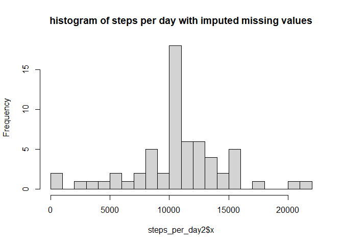

## Loading and preprocessing the data

```r
unzip("activity.zip")
activity<-read.csv("activity.csv", na.strings="NA",
                   colClasses=c("numeric", "Date", "numeric"))
head(activity)
```

```
##   steps       date interval
## 1    NA 2012-10-01        0
## 2    NA 2012-10-01        5
## 3    NA 2012-10-01       10
## 4    NA 2012-10-01       15
## 5    NA 2012-10-01       20
## 6    NA 2012-10-01       25
```


## What is the mean total number of steps taken per day?

```r
steps_per_day<-aggregate(x=activity$steps, by=activity["date"], FUN=sum)
mean_steps_per_day<-mean(steps_per_day$x, na.rm=T)
median_steps_per_day<-median(steps_per_day$x, na.rm = TRUE)
hist(steps_per_day$x, breaks=30, main="Histogram of steps per day")
```

<!-- -->

The mean total number of steps taken per day is 1.0766189\times 10^{4} and the median is 1.0765\times 10^{4}.


## What is the average daily activity pattern?

```r
library(dplyr)
activity_no_na<-filter(activity, !is.na(steps))
# aggreagate by interval, so we have the mean per interval over the months
steps_per_interval<-aggregate(x=activity_no_na$steps,
                              by=activity_no_na["interval"],
                              FUN=mean)
min_date<-min(activity_no_na$date)
max_date<-max(activity_no_na$date)

mean_max_steps<-max(steps_per_interval$x)
max_steps_index<-which(steps_per_interval$x==mean_max_steps)
interval_with_max_steps<-steps_per_interval$interval[max_steps_index]

plot(steps_per_interval, type="l", ylab="steps",
     main="mean number of steps per interval - considering data from two months")
```

<!-- -->

The plot above shows the number of steps per interval over the time between 2012-10-02 and 2012-11-29. On average, the interval that contains the maximum number of steps is 835 with an average of 206.1698113 steps.


## Imputing missing values

```r
library(dplyr)
grouped_by_interval<-group_by(activity, interval)
activity_complete<-mutate(grouped_by_interval,
                          completeSteps=ifelse(is.na(steps), mean(steps,na.rm = TRUE), steps))

steps_per_day2<-aggregate(x=activity_complete$completeSteps, 
                         by=activity_complete["date"], FUN=sum)

hist(steps_per_day2$x, breaks=30, main= "histogram of steps per day with imputed missing values")
```

<!-- -->

```r
head(activity_complete)
```

```
## # A tibble: 6 x 4
## # Groups:   interval [6]
##   steps date       interval completeSteps
##   <dbl> <date>        <dbl>         <dbl>
## 1    NA 2012-10-01        0        1.72  
## 2    NA 2012-10-01        5        0.340 
## 3    NA 2012-10-01       10        0.132 
## 4    NA 2012-10-01       15        0.151 
## 5    NA 2012-10-01       20        0.0755
## 6    NA 2012-10-01       25        2.09
```
For each `steps` value that is NA, we replace it with the value from the mean for the corresponding interval. That is possible because we first group the data frame by interval, so that the mean considers the grouping. The column 'completeSteps' then contains no NA values, but we keep the previous 'steps' column for reference.


## Are there differences in activity patterns between weekdays and weekends?

We clearly see in the graph below that there are some differences. For example, there's a spike in the first half of the weekdays, while on the weekend, the distribution is more spread out during the day.

```r
activity_weekends<-subset(activity_complete, weekdays(date, abbr=TRUE) %in% c("Sa", "So"))
activity_weekdays<-subset(activity_complete, !(weekdays(date, abbr=TRUE) %in% c("Sa", "So")))

par(mfrow=c(1,2))

steps_per_interval_weekend<-aggregate(
    x=activity_weekends$completeSteps,
    by=activity_weekends["interval"],
    FUN=mean)
plot(steps_per_interval_weekend, type="l", ylab="steps", col="blue",
     main="Mean steps/interval (weekend)")


steps_per_interval_weekday<-aggregate(
    x=activity_weekdays$completeSteps,
    by=activity_weekdays["interval"],
    FUN=mean)
plot(steps_per_interval_weekday, type="l", ylab="steps", col="red",
     main="Mean steps/interval (weekdays)")
```

<!-- -->
